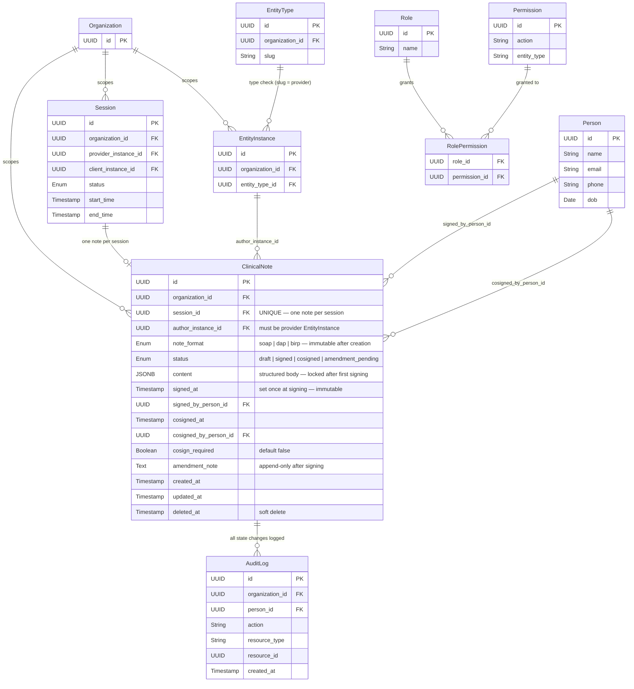

# SPEC-004: Clinical Notes — Entity Relationship Diagram

Tables owned by SPEC-004 and their relationships to tables from other domains.

## Relationship summary

| Relationship | Cardinality | Rule |
|---|---|---|
| Session → ClinicalNote | 1 : 0..1 | One note per session (UNIQUE on session_id). Soft-deleted notes still block creation of a replacement. |
| EntityInstance → ClinicalNote (author) | 1 : 0..N | Author must be a provider-type EntityInstance in the same org. |
| Person → ClinicalNote (signer) | 1 : 0..N | Person who signed. Requires `notes.sign` permission. |
| Person → ClinicalNote (co-signer) | 1 : 0..N | Person who co-signed. Requires `notes.cosign` permission. |
| Organization → ClinicalNote | 1 : 0..N | Multi-tenant scoping. All queries filter by org. |
| ClinicalNote → AuditLog | 1 : 0..N | Every POST/PATCH/DELETE/transition writes an audit entry (BR-07). |
