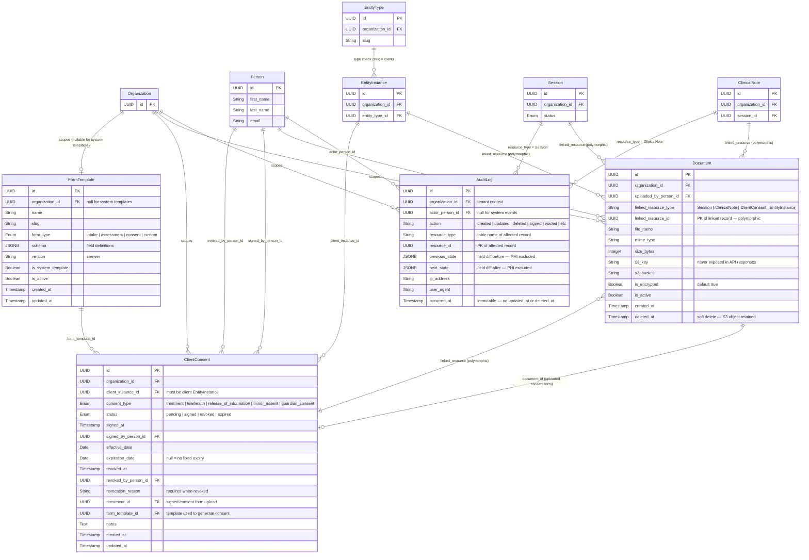

# SPEC-006: Documents, Consent, and Compliance — Entity Relationship Diagram

Tables owned by SPEC-006 and their relationships to tables from other domains.

## Relationship summary

| Relationship | Cardinality | Rule |
|---|---|---|
| Organization → AuditLog | 1 : 0..N | All audit entries scoped to tenant. |
| Person → AuditLog (actor) | 1 : 0..N | Null for system-triggered events. |
| Organization → Document | 1 : 0..N | All documents scoped to tenant. |
| Person → Document (uploader) | 1 : 0..N | Person who uploaded the file. |
| Document → linked resource | 0..1 : 0..N | Polymorphic link via `linked_resource_type` + `linked_resource_id`. Application-level validation, no DB FK. |
| Organization → ClientConsent | 1 : 0..N | All consent records scoped to tenant. |
| EntityInstance → ClientConsent | 1 : 0..N | Client instance who gave consent. Must be client EntityType. |
| Person → ClientConsent (signer) | 1 : 0..N | Person who recorded the signature. |
| Person → ClientConsent (revoker) | 1 : 0..N | Person who revoked consent. |
| Document → ClientConsent | 0..1 : 0..1 | Optional uploaded signed consent form. |
| FormTemplate → ClientConsent | 1 : 0..N | Template used to generate the consent form. |
| Organization → FormTemplate | 1 : 0..N | Nullable for system-provided templates (no org owner). |
| All domain tables → AuditLog | 1 : 0..N | Every state change across all domains writes an audit entry (BR-07). |
